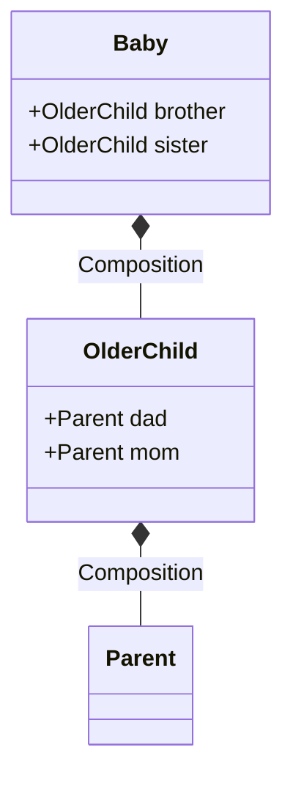
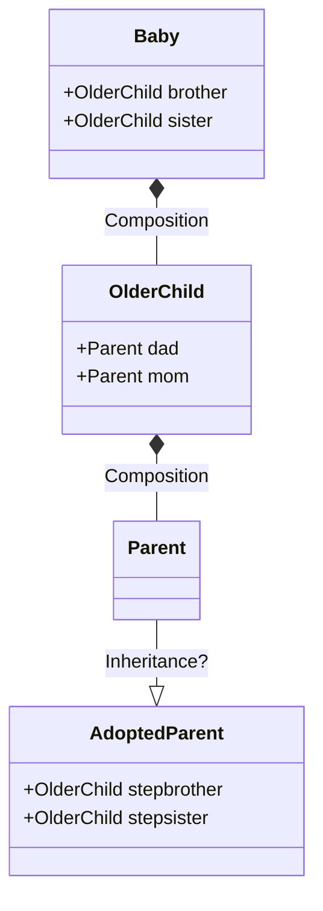

# Proxy Pattern

Design Pattern Type
: Structural [^1]

Also described as
: Wrapper

Objective
: Create a class functioning as an interface (proxy) which will increase reusability through change/override.

**Requirement**
1. Provide placeholder for "component"
2. Control access to the above placeholder
3. Add a wrapper/delegation to protect "component" from complexity

----

###Design Issue
Given such classes:
```systemverilog
        class Parent;
        ...
        class OlderChild;
            Parent dad = new;
            Parent mom = new;
        ...
        class Baby;
             OlderChild brother = new;
             OlderChild sister  = new;
        ...
```



If we wanted to modify Parent... 
```systemverilog
    class AdoptedParent extends Parent;
```

We cannot readily use inheritance, forcing us to modify given code.


So we use ***PROXY*** in lieu of these Objects

----

### Implementation in SystemVerilog

```systemverilog
virtual class Proxy #(type T);
    pure virtual function T create();
...
endclass : Proxy
class Wrapper #(type T) extends Proxy #(T);
    virtual function T create();
        T h = new();
        return h;
    endfunction : create
endclass : Wrapper

// See Factory Method pattern for additional detail
Proxy       factory[string];                        // create a factory
Wrapper #(Parent)           p = new;
Wrapper #(AdoptedParent)    ap = new;

Parent p_h;
begin
    factory["Parent"] = p;
    $cast( p_h, factory["Parent"].get() );          // Simple get which copies.

    factory["Parent"] = ap;
    $cast( p_h, factory["AdoptedParent"].get() );   // Ideally, upcasting or run-time error
end

```

----

## Implementation in UVM
### Proxy
```systemverilog
    // Our Proxy in base/uvm_factory.svh
    virtual class uvm_object_wrapper;
        virtual function uvm_object         create_object( ... );
        virtual function uvm_component      create_component( ... );
        pure virtual function string        get_type_name();
    endclass

    // Our Wrapper for UVM objects in base/uvm_registry.svh
    virtual class uvm_object_registry #(type T=uvm_object, string Tname="<unknown>") extends uvm_object_wrapper;

        // Creation
        virtual function uvm_object         create_object( ... );
            T obj = new();
            ...
            return obj;
        endfunction : create_object

        // ...

        const static string                 type_name = Tname;
        virtual function string             get_type_name();
            return type_name;
        endfunction : get_type_name
    endclass
```

---

|Additional Resources||
|--|--|
|OOP Design Pattern Example| https://verificationacademy.com/sessions/oop-design-pattern-examples |


[^1]: [Design Patterns: Elements of Reusable Object-Oriented Software](https://springframework.guru/gang-of-four-design-patterns/)
