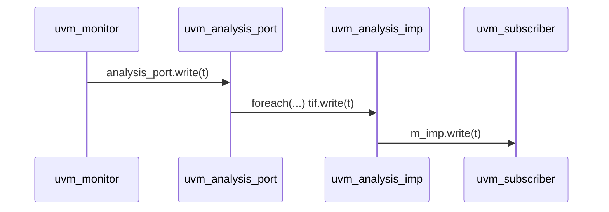

# Observer Pattern

Design Pattern Type
> Behavioral [^1]

Also Known as
> Publish/Subscribe

Objective
 >  1. Publisher and Subscriber(s) should be defined without coupling implementation
 >  2. Ensure that change in one propagates to dependents automatically
 >  3.  Publisher should be able to support any number of subscribers

Requirement
> 1. Two Actors : Subject and Observers
> 2. When Subject changes state, all registered Observers are notified and updated
> 3. Observers will register itself to Subject
> 4. Subject will push notification to all Observers upon change/update.

---
## Implementation in UVM

```systemverilog
    // Interface receiving from Publisher/Subject
    class uvm_analysis_port #(type T=int) extends uvm_port_base #(uvm_tlm_if_base #(T,T));
        ...
        // Here is the implementation on Publish
        function void write ( input T t );
            uvm_tlm_if_base #(T,T)          tif;    // contains the common methods for TLM API
            for( ... )
                tif = this.get_if (i);              // returns m_imp_list[i], list kept within uvm_port_base
                ...
            tif.write(t);                           // WRITE method is called on Subscriber
        endfunction
    endclass

    // Interface to Subscriber (TLM IMPLEMENTATION PORT)
    class uvm_analysis_imp #(type T=int, type IMP=int) extends uvm_port_base #(uvm_tlm_if_base #(T,T));
        function void write ( input T t );
            m_imp.write (t);                        // m_imp is of type Subcriber (if uvm_subscriber creates)
        endfunction
    endclass

                                                    // Subscriber implements the write method.
```

---



UVM monitor (subject)
> Declare and Build uvm_analysis_port

UVM subscriber (subscriber)
> Implement write(t) method

Note
> Usage of TLM analysis implementation port (tlm_analysis_imp) means, no responses...
> Therefore, the usage is limited to unidirectional communication.

[^1]: [Design Patterns: Elements of Reusable Object-Oriented Software](https://springframework.guru/gang-of-four-design-patterns/)
