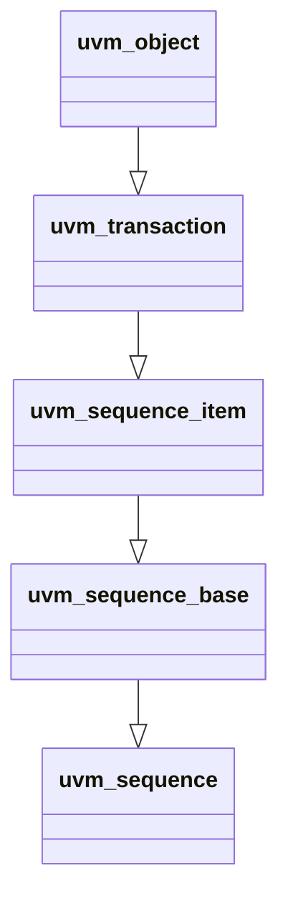

# Sequence Hierachy : uvm_sequence #(REQ,RSP)

## Class Hierarchy



## UVM Sequence #(REQ,RSP)
- Provides interface to create STREAMS of uvm_sequence_item or other sequences
- Typed with Request and Response of uvm_sequence_item

----

### Important Properties

```systemverilog
    REQ                             req;                                // Request sequence
    RSP                             rsp;                                // Response sequence

    sequencer_t                     param_sequencer;                    // Sequencer #(REQ,RSP)
```

----

### Important Methods

```systemverilog
    function uvm_sequence_state_enum        get_sequence_state();       // get STATE enum
    function void                           send_request();             // calls m_sequencer.send_request()
    function REQ                            get_current_item();         // returns param_Sequencer.get_current_item()

    // ---- Response ----
    virtual task                            get_response(*);            // calls get_base_response()
```
----
