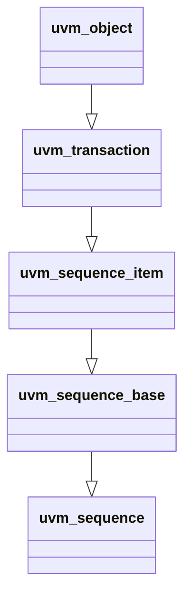
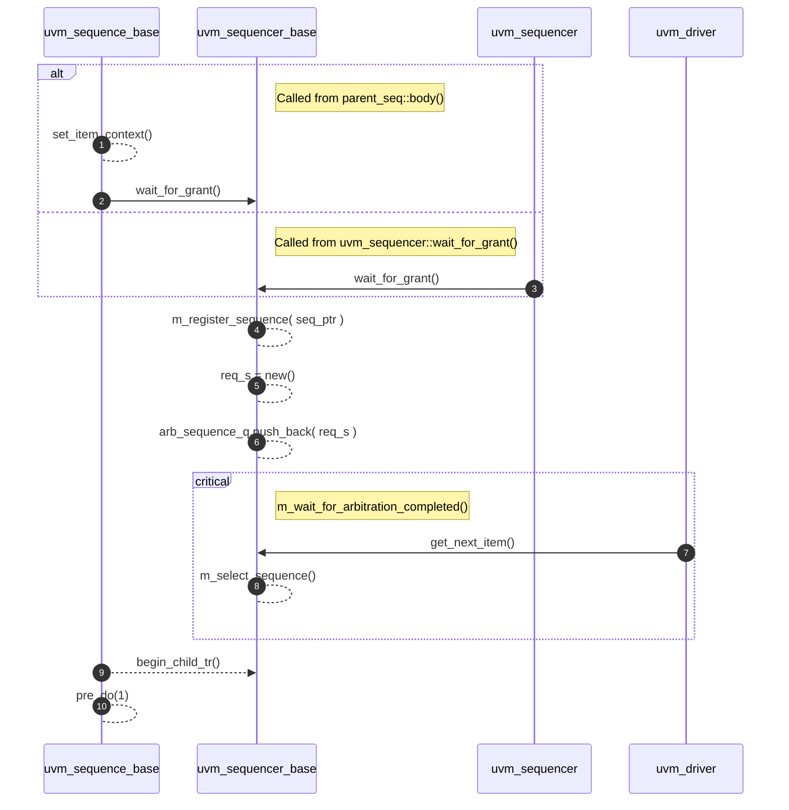
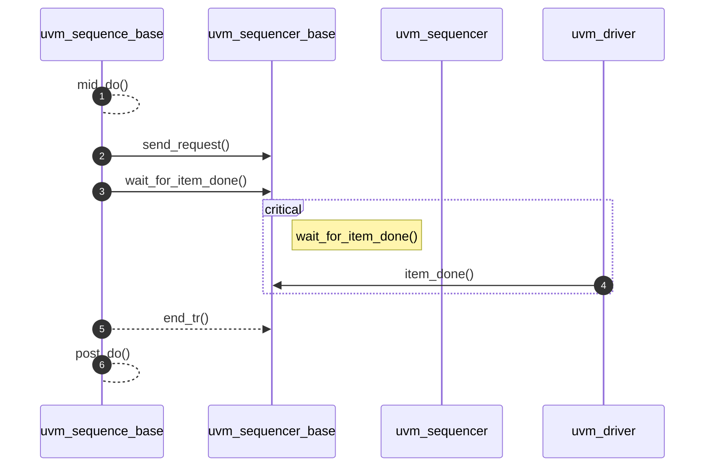
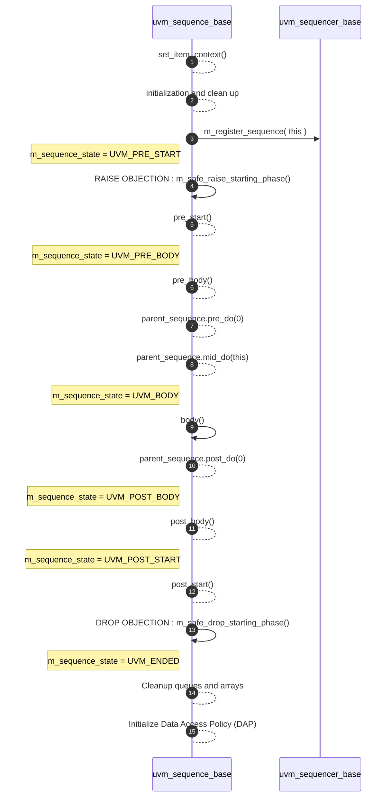

# Sequence Hierachy : uvm_sequence_base

## Class Hierarchy



## UVM Sequence Base
- Interfaces for creating streams of sequence items
- Sequence Execution Flow
- Sequence Item Execution Flow

---
## What is Sequence Item Execution Flow?


Generally begins with start_item and finish_item
- start_item notifies to the sequencer that it is "READY TO USE"
- Most likely, this was called through parent's body() task or `uvm_do


### This is what Start Item looks like



### [2] wait_for_grant() details
1. Register sequence into ***reg_sequences*** associative array
2. Create and configure REQUEST object and push into ***arb_sequence_q***
3. Wait for the Arbitration to be completed (WAIT implementation)

### [6,9] wait_for_arbitration_completed details
- forever loop: whenever arb_completed is updated, check arb_completed associated array
- checked via request_id(aka sequence_id)
- wait for another update  (until the size of above array changes)


### This is what Finish Item looks like


---

## What is Sequence Execution Flow?

Generally begins with start
- call randomize, then call start method
- This utilizes body() task block
- you include pre_body() and post_body() callbacks





----

### Important Properties

```systemverilog
    protected uvm_sequence_state    m_sequence_state;                   // Sequence STATE enum
    local int                       m_priority = -1;                    // for UVM_SEQ_ARB_WEIGHTED
    
    protected int                   m_sqr_seq_ids[int];                 // tracks sequence_id
    protected bit                   children_array[uvm_sequence_base];
    protected uvm_sequence_item     response_queue[$];                  // response queue
    protected process               m_sequence_process;                 // process id for fine-grain control

    local uvm_get_to_lock_dap#(uvm_phase)   m_starting_phase_dap;       // holds the starting phase
```

----

### Important Methods

```systemverilog
    function uvm_sequence_state_enum        get_sequence_state();       // get STATE enum

    function void                           m_init_phase_daps(*)        // create or rename Data Access Policy

    task                                    lock(seqr);                 // request lock on SEQR
    task                                    unlock(seqr);
    task                                    grab(seqr);                 // request lock then put SEQ in front
    task                                    ungrab(seqr);
    function void                           kill();                     // kill and clean up

    
    // ---- Sequence Execution ----
    virtual task                            start(*);                   // Sequence Execution Start

    // ---- Sequence Item Execution ----
    protected function uvm_sequence_item    create_item(*);             // create/initialize seq via factory
    virtual task                            start_item(*);              // Initiate a sequence item
    virtual task                            finish_item(*);             // Other half of initiation 
                                                                        // no delays btw. start_item/finish_item
    virtual task                            wait_for_grant(*);          // issues REQ to SEQR, return when granted
    virtual task                            send_request(*);            // used to fwd. REQ to DRV through SEQR
    virtual task                            wait_for_item_done();       // (optional) block until DRV calls item_done/put

    // ---- Response API ----
    virtual function void                   put_response(*);            // push RSP into queue
    virtual task                            get_base_response(*);       // pop from RSP queue
```
----
