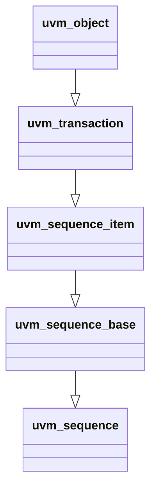

# Sequence Hierachy : uvm_sequence_item

## Class Hierarchy



## UVM Sequence Item
- Adds Sequence ID
- Adds Hiearchy (depth/parent/root/path)
- Adds Default Sequencer
- Adds Sequence Info

----

### Important Properties

```systemverilog
    local       int                 m_sequence_id = -1;     // Tracks Sequence ID for Sequencer or Composition uses
    protected   bit                 m_use_sequence_info;    // Controls if the info is recorded/printed/copied
    protected   int                 m_depth = -1;           // Hierarchy Depth found through recursion
    protected   uvm_sequencer_base  m_sequencer;            // Default Sequencer of Default type uvm_sequence_item
    protected   uvm_sequence_base   m_parent_sequence;      // Parent Sequence if any
```

----

### Important Methods

```systemverilog
    function int                    get_sequence_id()       // See "Used to set the local sequence id
    function void                   set_item_context(*)     // Sets m_use_sequence_info, parent, sequencer, depth
    function void                   set_id_info(*)          // Sets transaction and sequence ID
    function bit                    is_item()               // returns 1 if sequence_item
    function string                 get_root_sequence_name()
    function string                 get_sequence_path()     // String of names of each sequences in a full hierarchy path

    function void                   set_sequencer(*)        // Sets m_sequencer
    function void                   m_set_p_sequencer()     // no implementation until `uvm_declare_p_sequencer is called
```
----

#### What is Sequence ID used for?
- This sequence ID is used to identifiy some sequences to the sequencer.
- ID is assigned automatically through ***uvm_sequencer_base::wait_for_grant()*** method
