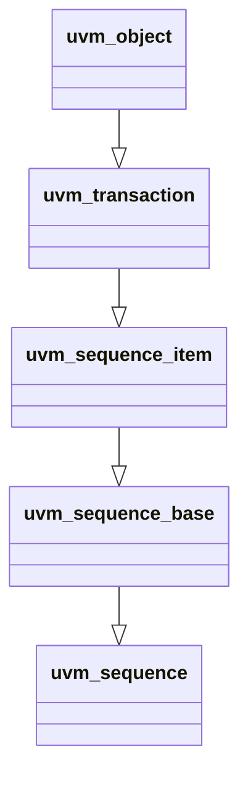

# Sequence Hierachy : uvm_transaction

##  Class Hierarchy



##  UVM Transaction
Adds onto the UVM Object the following
> 1. Transaction ID     with its GET/SET methods
> 2. Initiator          with its GET/SET methods
> 3. Recording          with its ENABLE/DISABLE methods
> 4. Accept/Begin/End Transaction methods

----

###  Important Properties

```systemverilog
    local integer       m_transaction_id = -1;      // This one tracks the transaction for completion

    local time          accept_time=-1;             // Debuggability.  set when uvm_transaction::accept_tr() is called
    local time          begin_time=-1;              // Debuggability.  set when uvm_sequence_item::start_item() is called
    local time          end_time=-1;                // Debuggability.  set when uvm_sequence_item::finish_item() is called
```

###  Events

```systemverilog
    uvm_event_pool      events;                     // dictionary : uvm_pool #( uvm_event #(uvm_object) )

    function integer    begin_tr( time );           // triggers begin_event via uvm_sequence_item::start_item ()
    uvm_event           begin_event;                // assigned "begin" event from above dictionary
    
    function integer    end_tr( time );             // triggers end_event via uvm_sequence_item::finish_item ()
    uvm_event           end_event;                  // assigned "end" event from above dictionary
```

####  uvm_pool
> Dynamic Associate Array

####  uvm_event
> SV event (m_event) wrapper with support for callbacks

