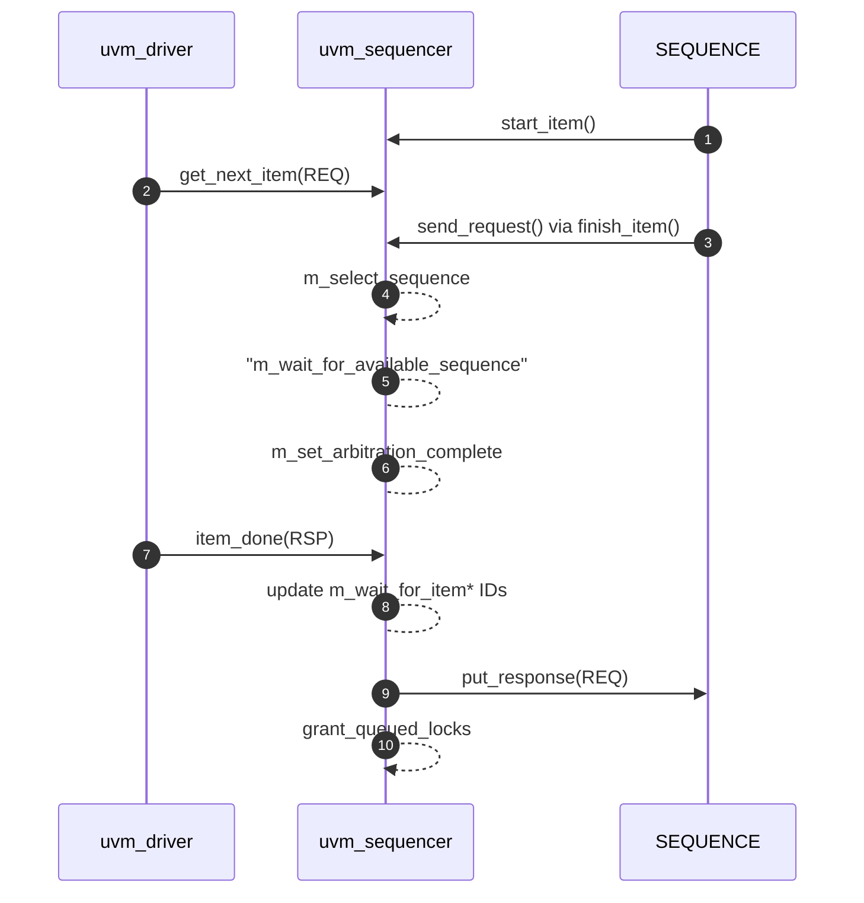

# Sequencer


## Flow



#### Details 

1. Sequence starts...
   
2. [Call from Driver] m_sequencer.get_next_item( txn );
   
3. seq.finish_item() will call send_request()
   > 1. send_request() will push into ***m_req_fifo***

4. m_select_sequence() will try to get fetch from **arb_sequence_q** 
   > 1. Try to fetch from ***arb_sequence_q***
   > 2. Update ***arb_completed[req_id]***
   > 3. peek() from ***m_req_fifo***

5. if none available, wait for arbitration list to be updated
   
6. push into ***arb_completed[req_id]*** assoc.array
   
7. driver calls item_done() which will do #8~10
   
8. reset internal flags and properties
   
9. if RSP, put_response() to its TLM port
    
10. Grant any locks ASAP

###  Important Properties

```systemverilog
    // uvm_sequencer_base
    protected uvm_sequence_request          arb_sequence_q[$];          // Queue of Sequences waiting
    protected bit                           arb_completed[int];         // Completed sequences [key: seqid]
    protected uvm_sequence_base             lock_list[$];               // Stores blocked sequences
    protected uvm_sequence_base             reg_sequences[$];           // Sequence Queue (via seqid)
    local uvm_Sequencer_arb_mode            m_arbitration;              // Arbitration Mode

    // uvm_sequencer_param_base
    REQ                                     m_last_req_buffer[$];       // Request history
    RSP                                     m_last_rsp_buffer[$];       // Response history

    // uvm_sequencer
    uvm_seq_item_pull_imp #(REQ,RSP,this_type)      seq_item_export;    // TLP port for connectivity
```

### Important Methods

```systemverilog
    // uvm_sequencer_base
    virtual function integer    user_priority_arbitration(*);   // UVM_SEQ_ARB_USER mode: need implementation
    virtual task                wait_for_grant(*);              // Issue Request for specific SEQ  (see below)
                            //  wait for grant( seq, priority, lock_req )
                            //  1. register sequence
                            //  2. create REQ from above seq, and push it into ***arb_sequence_q***
                            //  3. wait for aribtration to be completed
                            //  4. wait for send_request completion from the REQ
    virtual task                wait_for_item_done(*)           // [opt] block 'til DRV calls item_done() or put()
    virtual function void       set_arbitration( arb_type );    // Set Arbitration Mode
    virtual task                lock( seq );                    // Request lock "for the" seq.  earlier first...
    virtual task                unlock( seq );                  // Undo lock "for the" seq.
    virtual task                grab( seq );                    // Request lock "for the" seq.  this one first...
    virtual task                ungrab( seq );                  // Undo grab "for the" seq.
    virtual task                stop_sequences();               // Kill all sequence and remove reqeuests

    // uvm_sequencer_param_base
    virtual function void       send_request(*);                // called by sequence.  send the REQ to DRV
                            //  send_request( caller, REQ,  )
                            //  1. check that wait_for_grant (start_item) has been called via caller
                            //  2. set REQ's transaction id
                            //  3. update request history
                            //  4. set REQ's sequence id
                            //  5. set REQ's sequencer to this sequencer
                            //  6. put copy of REQ into m_req_fifo
                            //  7. grant any locks ASAP
    function REQ                get_current_item(*);            // get current item executed
    function REQ                last_req(n);                    // grab the last request item

    // uvm_sequencer
    virtual task                get_next_item( t );             // Get next available item from SEQ
    virtual task                try_next_item( t );             // Try to get next available item from SEQ
    virtual task                item_done( rsp );               // Indicate that request is completed
    virtual task                put ( rsp );                    // Send RSP back to SEQ
    task                        get ( txn );                    // Retrieve next available item from SEQ
    task                        peek ( txn );                   // Peek at next available item from SEQ
```

