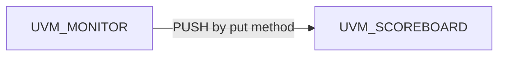

# TLM1 Port - One-to-One relationship

### PULL vs PUSH
TLM has a relationship between...
- PRODUCER (Produce transaction)
- CONSUMER (Consume transaction)

### Producer -> Consumer : push

This is when we try to send a transaction to the consumer.
If you need a single 

### Consumer <- Producer : pull

